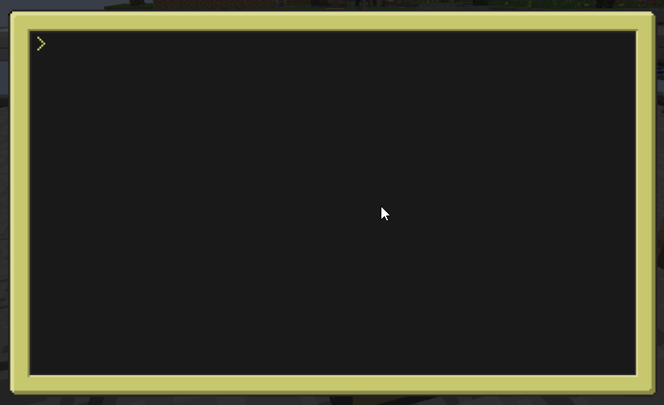

# Advent of Code 2020

Advent of Code is an Advent calendar of small programming puzzles for a variety of skill sets and skill levels that can be solved in any programming language you like. People use them as a speed contest, interview prep, company training, university coursework, practice problems, or to challenge each other.

For more information visit: https://adventofcode.com/2020/about

This repo contains my code snippets for solving the puzzles using java.  

**This branch conatins lua code and is meant to run on a modded minecraft server running [computercraft](http://www.computercraft.info/).**  
**Have a look at this demo:**

You may ask:  
_"There are many languages that are better suited. This is just pure pain So why lua?"_

My answer:

